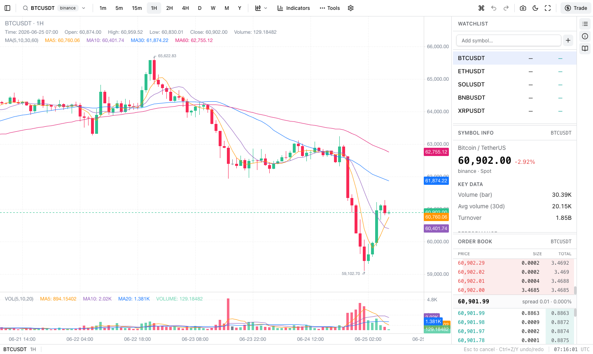

# TradeDash

A **live demo of [`react-klinecharts-ui`](https://github.com/NemeZZiZZ/react-klinecharts-ui)** — a TradingView-like trading terminal built entirely on its headless hooks, with full source code you can read and reuse.

The library is headless (hooks + state, no UI). This project is one possible UI on top of it: a complete terminal assembled from [shadcn](https://ui.shadcn.com/)-style components on [Base UI](https://base-ui.com/) primitives.

**▶ Live demo: https://nemezzizz.github.io/tradedash/**



---

## What it demonstrates

Every feature below is powered by a `react-klinecharts-ui` hook — the app is essentially a tour of the library's surface:

| Area | Hook(s) | In the app |
| --- | --- | --- |
| Chart + data | `KlinechartsUIProvider`, `createDataLoader`, `useKlinechartsUI` | Candles/bars/area, live data |
| Symbols | `useSymbolSearch` | Search dialog, per-source filtering |
| Timeframes | `usePeriods` | Toolbar group + number-key shortcuts |
| Indicators | `useIndicators` | Catalog, params editor, visibility, collapse/reorder, **secondary Y-axis** |
| Drawing | `useDrawingTools` | 26 tools, magnet, lock/visibility, freehand brush |
| Order lines | `useOrderLines` | Draggable entry/stop lines with labels |
| Alerts | `useAlerts` | Labelled price alerts + sound |
| Replay | `useReplay` | Bar-by-bar playback with scrubber |
| Compare | `useCompare` | Overlay symbols normalized to % |
| Measure / Notes | `useMeasure`, `useAnnotations` | Ruler readout, chart notes |
| Layouts | `useLayoutManager` | Save / load / autosave |
| Script editor | `useScriptEditor` | JS custom indicators |
| Settings | `useKlinechartsUISettings` | Candle/axis/tooltip configuration |
| Theme / Fullscreen / Screenshot | `useKlinechartsUITheme`, `useFullscreen`, `useScreenshot` | Toolbar actions |
| Timezone | `useTimezone` | 18 zones + live status-bar clock |
| Export | `useDataExport` | CSV / JSON |
| Hotkeys / Axes | `useHotkeys`, `useChartAxes` | Keyboard map, axis overrides |

Plus UI assembled around the library:

- **Pluggable datafeed** — an abstract registry aggregating multiple CORS-friendly sources (Binance, Bybit, OKX) with REST history + native kline WebSockets, plus an offline synthetic source.
- **Right dock** — resizable panel stacking watchlist, symbol info (live price, performance, technicals gauge) and a scrollable order book; toggled from a far-right activity bar.
- **Command palette** (`Ctrl/Cmd+K`), **context menu**, **buy/sell on chart**, **price-flash watchlist**.
- **16 languages** with browser detection and **RTL** support (Arabic).

## Tech stack

- **React 19** + **TypeScript** + **Vite 6**
- **Tailwind CSS v4** + **Base UI** (shadcn-style components, hand-written)
- **react-klinecharts-ui** + **react-klinecharts** + **klinecharts v10**
- **Vitest** for unit tests, **ESLint** (flat config)

## Getting started

```bash
pnpm install
pnpm dev        # http://localhost:5173
```

```bash
pnpm build      # typecheck (tsc -b) + production build to dist/
pnpm preview    # serve the production build
pnpm lint       # ESLint
pnpm test       # Vitest
```

## Datafeed

Sources implement a small `DataSource` interface and are combined by a registry into one `Datafeed`:

```ts
// src/datafeed/index.ts
export const datafeed = createDatafeed([
  new BinanceDataSource(),
  new BybitDataSource(),
  new OkxDataSource(),
  new SyntheticDataSource(), // offline fallback
]);
```

To plug in your own backend, add a class implementing `DataSource` (`searchSymbols`, `getHistoryKLineData`, `subscribe`, `unsubscribe`, optional `subscribeDepth`) and register it. See [`src/datafeed/`](src/datafeed/).

## Project layout

```
src/
  datafeed/            # DataSource registry + Binance/Bybit/OKX/synthetic + order-book merge
  i18n/                # 16-language catalog, detection, RTL
  components/
    ui/                # shadcn-style primitives on Base UI
    terminal/          # the terminal: toolbar, dock, dialogs, panels, chart
  hooks/               # persistence, live price, modal state
```

## Deployment

Pushing to `main` builds and deploys to GitHub Pages via [`.github/workflows/deploy.yml`](.github/workflows/deploy.yml).
The production `base` is `/tradedash/` (override with the `VITE_BASE` env var if the repo is renamed).

## License

[MIT](LICENSE) — use it as a reference or starting point for your own terminal.

> Built to be linked from the `react-klinecharts-ui` documentation as a living example.
